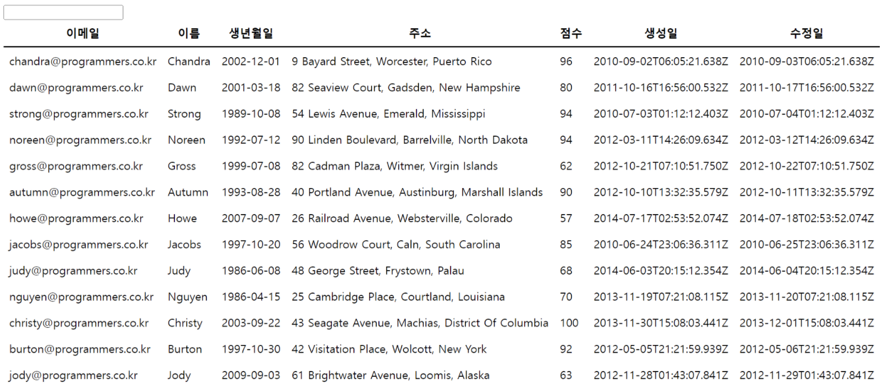
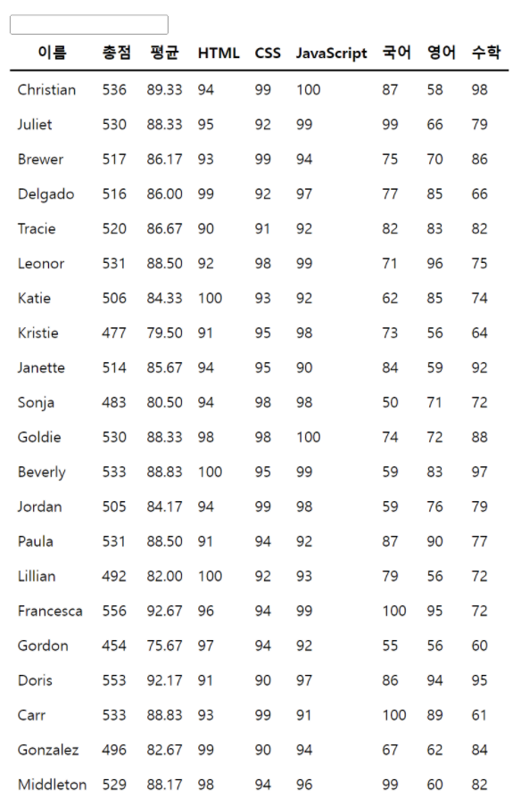

# 과제

## 문제 내용

여러분은 백엔드 엔지니어 친구가 자신이 정리해둔 JSON 데이터를 보기 편하게 만들어 줄 수 있냐는 부탁을 받았습니다.

이 데이터들을 멋지게 그려주는 간단한 그리드 컴포넌트를 만들어보도록 합시다!

## 구현 내용

#### 공통사항

- 세팅되어있는 환경 외에 별도의 라이브러리 설치 및 사용을 금합니다.
	- CDN을 통한 라이브러리 로딩, npm install 을 통한 설치 및 사용 등은 금지됩니다. 위의 사항을 지키지 않는 경우 불합격 됩니다.
- es6 module 방식으로 구현할 경우 가산점이 있습니다.
- 비동기 호출이 일어나는 곳에서 async, await를 적절히 사용하여 구현한 경우 가산점이 있습니다.
- 각 컴포넌트나 함수 유틸 등은 역할에 맞게 적절히 파일을 나누어 코딩합니다.
- 각 컴포넌트나 함수 유틸 등은 예기지 않은 입력값이 들어왔을 경우를 대비한 방어 코드를 충분히 작성하도록 합니다.
- var 사용은 최대한 지양하고 let과 const를 중심으로 사용합니다.
- 전역오염도 불필요한 경우가 아니면 피하도록 합니다.

#### 그리드 컴포넌트 구현하기

- 3개의 JSON 데이터를 화면에 렌더링 해주는 데이터 그리드 컴포넌트를 만듭니다.

	- [x] JSON 데이터는 data 폴더 안에 `data1.json`, `data2.json`, `data3.json` 이라는 이름으로 있습니다.

	- [x] `fetch` API를 이용해 비동기 코드를 적절하게 사용하여 위의 JSON을 불러와서 사용합니다.

	- [x] 각 데이터별로 별도의 컴포넌트를 정의하는 것이 아니라, 정의된 데이터 그리드 컴포넌트가 샘플로 제시되는 3개의 JSON 데이터가 모두 호환이 되도록 만들어야 합니다.

		> **(중요)** 만약 하나의 컴포넌트로 구현하지 않으면 불합격입니다.
		> 또한 컴포넌트 하나에서 데이터 세 개를 모두 렌더링하는 게 아니라, 하나의 데이터는 하나의 데이터 그리드로 처리하도록 합니다. 즉 컴포넌트 정의는 하나이고, 해당 컴포넌트를 데이터별로 인스턴스화해서 처리하거나 혹은 비슷한 방법으로 처리하도록 합니다.

	- [x] 제시된 형태의 데이터가 아니더라도, 범용적으로 사용할 수 있는 형태의 컴포넌트여야 합니다.

- [x] JSON 데이터는 `fetch API`를 통해 제시된 URL에서 불러오도록 합니다.

	- `fetch API` 호출 시, `/web/`을 절대경로로 붙여주어야 합니다.

- [x] table을 사용해 구현하며, 각 영역에 따라 thead, tbody 등을 알맞게 사용하도록 합니다.

- 아래와 같이 구현합니다.

	- data1.json을 이용해 렌더링한 그리드

	- 각 컬럼의 값은 아래의 키를 참고합니다.

		- 이메일: email

		- 이름: profile.name

		- 생년월일: profile.birthday

		- 주소: profile.address

		- 점수: score

		- 생성일: createdAt

		- 수정일: updatedAt

	

	- data2.json을 이용해 렌더링한 그리드
	- 각 컬럼의 값은 아래의 키를 참고합니다.
		- 이름: username
		- 총점: scores의 모든 점수를 합한 값
		- 평균: scores의 모든 점수의 평균. 소숫점 2자리까지만 표기합니다.
		- HTML: scores.html
		- CSS: scores.css
		- JavaScript: scores.javascript
		- 국어: scores.korean
		- 영어: scores.english
		- 수학: scores.math

	

	- data3.json을 이용해 렌더링한 그리드
	- 각 컬럼의 값은 아래의 키를 참고합니다.
		- 번호: index
		- 닉네임: nickname
		- 나이: profile.age
		- 원격근무지: profile.remoteWorkLocation
		- 포지션: profile.position
		- 검증여부: verified
			- `boolean` 형태이며, `true`인 경우 `검증`, `false`인 경우 `미검증`으로 렌더링 합니다.

	

- 위에 제시된 세 개의 그리드를 한 화면에 모두 렌더링 하도록 합니다.

#### 정렬기능 구현하기

- 필수 구현사항

	- [x] 그리드 컴포넌트의 헤더를 클릭하면, 해당 헤더 데이터 기준으로 오름차순 정렬이 되도록 합니다.

		- [x] 이때 헤더 텍스트 옆에 오름차순으로 정렬이 되었다는 표시로 🔼이모지를 넣습니다.
		- [x] 오름차순으로 정렬이 된 헤더를 다시 클릭하면, 이번에는 내림차순으로 정렬하여 렌더링하고 🔼 대신 🔽이모지를 넣습니다.
		- [x] 내림차순으로 정렬된 헤더를 다시 클릭하면, 해당 정렬 상태를 해제하여 데이터의 순서대로 렌더링 되도록 만듭니다.
		- [x] 특정 헤더 기준으로 오름차순 정렬이 된 상태에서 다른 헤더를 클릭하면, 이전에 정렬 되었던 오름차순 정렬은 해제하며 새로 클릭된 헤더의 값 기준으로 오름차순 정렬을 하도록 합니다.
		- [x] 정렬은 sort 함수를 이용하여 구현하며, 헤더별로 구분 없이 아래의 로직을 참고하여 구현합니다.

		```js
		if (a < b) {
		  return sortOrder === 'ASC' ? -1 : 1
		} else if (a > b) {
		  return sortOrder === 'ASC' ? 1 : -1
		} else {
		  return 0
		}
		```

- 보너스 구현사항

	- 헤더 클릭과 관련하여 이벤트를 최적화하는 경우, 가산점이 있습니다.

#### 검색기능 구현하기

- 필수 구현사항

	- [x] 기본 마크업을 참고하여 그리드의 상단 좌측에 input을 넣습니다.

	- [x] 해당 input에 값을 입력하면, 해당 값이 있는 데이터만 필터해서 보여주는 기능을 구현합니다.

- 보너스 구현사항

	- input 내에 입력한 키워드와 그리드 텍스트들 내에 일치한 부분을 제공되는 마크업을 참고하여 강조 처리할 경우, 가산점이 있습니다.
	- 키워드 입력이 될 때마다 검색을 시도하는 방식이 아닌, 사용자의 키 입력이 끝났다고 판단된 이후에 검색을 시도하도록 최적화한 경우 가산점이 있습니다.